

  

  <h1>Hey, I'm Loryan 👋</h1>

  

    <strong>Microsoft MVP · Microsoft 365 Architect · Home-Automation Tinkerer · Open-Source Builder</strong> 
    Based in Australia 🇦🇺
  

  <!-- Social / profile badges -->
  <a href="https://www.linkedin.com/in/loryanstrant/" target="_blank">
    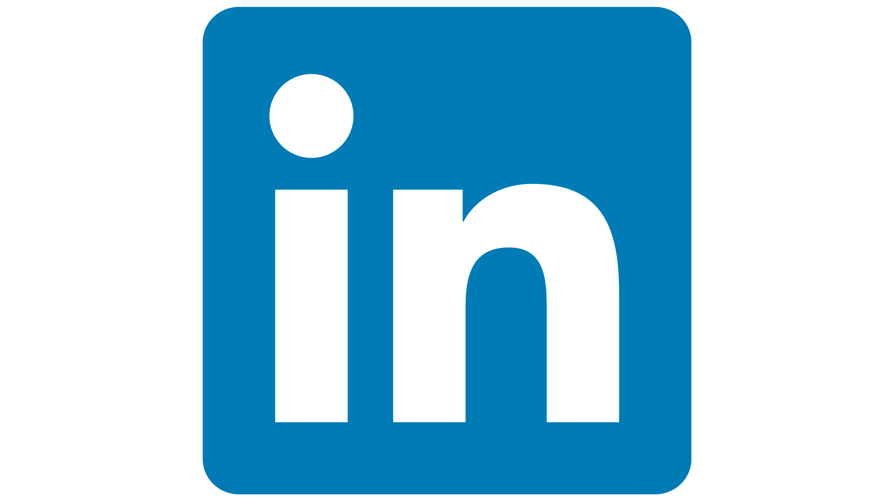
  </a>&nbsp;
  <a href="https://mvp.microsoft.com/en-US/MVP/profile/d9ba70c0-3c9a-e411-93f2-9cb65495d3c4" target="_blank">
    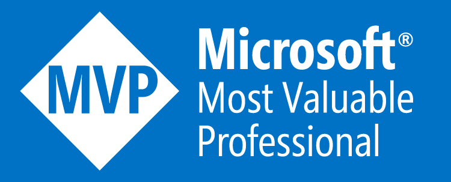
  </a>&nbsp;
  

---

## About Me

I'm someone who genuinely gets excited about technology — not for the sake of it, but because of what it enables people to do.

Over the past decade-plus I've spent most of my professional life deep inside the **Microsoft 365** and **Azure** ecosystem, helping organisations navigate the ever-growing (and occasionally bewildering) catalogue of cloud services. I've architected migrations, designed governance frameworks, built automation workflows, and written more Power Automate flows than I care to admit.

But I'm equally at home in the garage (metaphorically speaking) — tinkering with **Home Assistant**, building **Docker** containers for things that absolutely did not need to be containerised, wiring up **MQTT** sensors, and generally automating everything that stands still long enough. If there's a script to be written, an integration to be built, or a repo to be started, I'm in.

A few things I'm known for:
- 🏆 **Microsoft MVP** — recognised for community contributions in Microsoft 365 and related technologies
- ☁️ Building and curating the **Microsoft Cloud Logos** collection (now the go-to resource for consistent branding)
- 🔍 Calling out Microsoft's own typos and logo inconsistencies so nobody else has to
- 🤖 Bridging the Microsoft cloud world and the self-hosted AI / home-automation world in ways that probably shouldn't work, but do
- 📢 Writing, speaking, and sharing — because the best ideas are the ones you give away

If it's broken, I'll try to fix it. If it doesn't exist, I'll build it. And if it already exists but could be better, well… that's what pull requests are for.

---

## 📊 GitHub Stats

  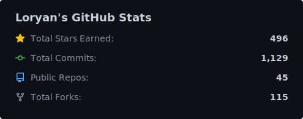
  &nbsp;
  

---

## 🛠️ Technologies & Platforms

> A word cloud of the apps, platforms, and services my repositories are built around — *not* the programming languages, but what they actually *do*.

  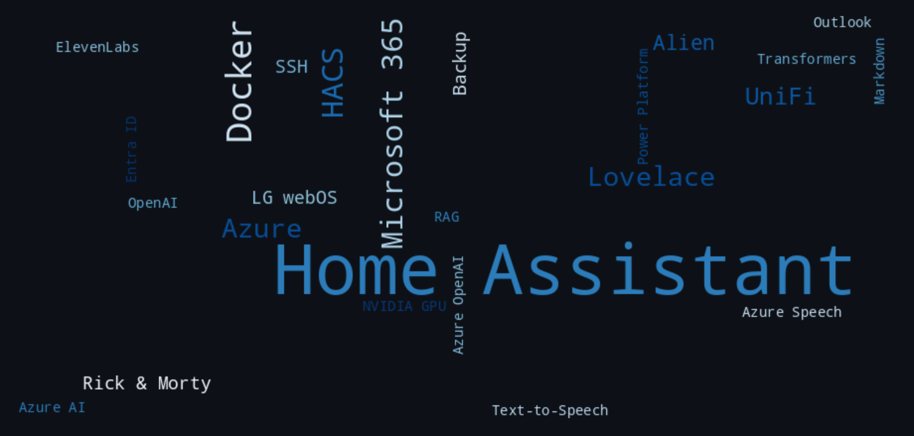

---

## 📈 My GitHub Journey

> Yearly totals for stars earned, new repositories created, and commits pushed — refreshed weekly by a GitHub Actions workflow.

  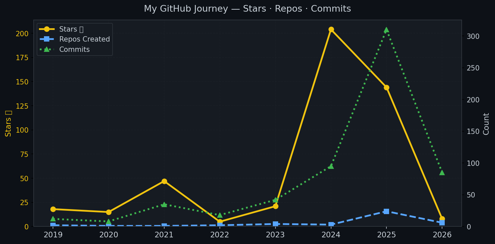

---

## ⭐ Most Popular Repositories

  <a href="https://github.com/loryanstrant/MicrosoftCloudLogos">
    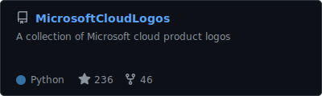
  </a>
  <a href="https://github.com/loryanstrant/PowerThings">
    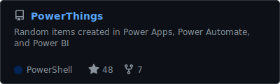
  </a>
  <a href="https://github.com/loryanstrant/ha-MU-TH-UR-6000-cards">
    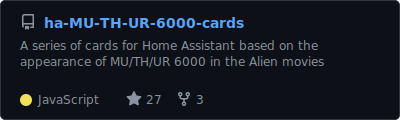
  </a>
  <a href="https://github.com/loryanstrant/ha-weylandyutani">
    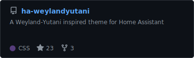
  </a>
  <a href="https://github.com/loryanstrant/anzusergroups">
    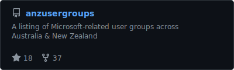
  </a>
  <a href="https://github.com/loryanstrant/ha-youtubevideocard">
    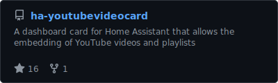
  </a>

---

## 🌐 My Sites

<table>
  <tr>
    <td width="50%" valign="top">
      <h3>
        <a href="https://www.loryanstrant.com">🖊️ loryanstrant.com</a>
      </h3>
      

        My personal blog — where I write about everything from Microsoft 365 governance and Azure architectures
        to Home Assistant automations and the occasional rant about technology that should work better than it does.
        If you want honest, practical takes on the Microsoft cloud ecosystem (and beyond), this is the place.
      

    </td>
    <td width="50%" valign="top">
      <h3>
        <a href="https://www.letmecorrectthatforyou.com">🔍 letmecorrectthatforyou.com</a>
      </h3>
      

        A catalogue of typos, incorrect logos, and factual errors found across the Microsoft ecosystem —
        not just in Microsoft's own products and documentation, but also from partners, consultants, MVPs, and everyday users.
        If someone can misspell "SharePoint" in SharePoint, someone should keep track — and that someone is me.
        Equal parts frustrating and entertaining.
      

    </td>
  </tr>
  <tr>
    <td colspan="2" valign="top">
      <h3>
        <a href="https://www.mscloudlogos.com">☁️ mscloudlogos.com</a>
      </h3>
      

        The definitive collection of Microsoft cloud product logos — consistently sized, correctly branded, and
        freely available. Whether you're building a presentation, designing an architecture diagram, or just need
        the right Entra ID icon at the right resolution, this is your one-stop shop. Even some Microsoft staff
        use this as their go-to resource.
        Also available as the open-source
        <a href="https://github.com/loryanstrant/MicrosoftCloudLogos">MicrosoftCloudLogos</a> repo.
      

    </td>
  </tr>
</table>

---

  
    Profile assets (word cloud &amp; trend chart) are auto-refreshed weekly via
    <a href=".github/workflows/update-profile.yml">GitHub Actions</a>.
  

