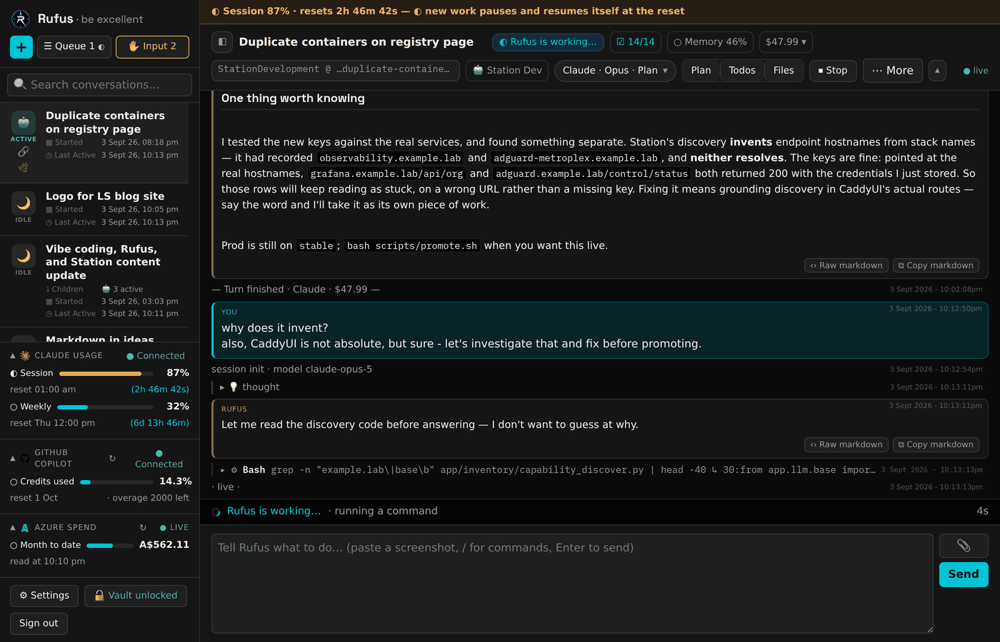
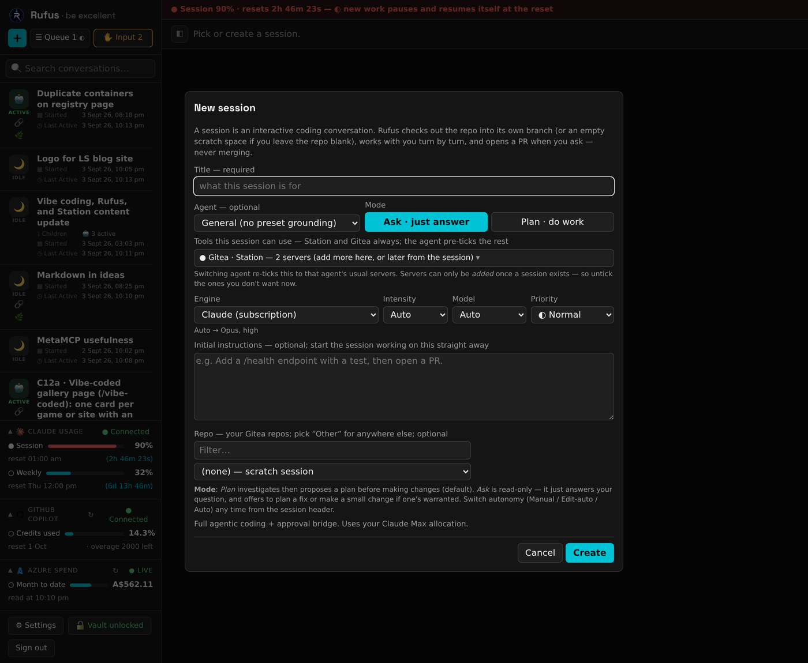
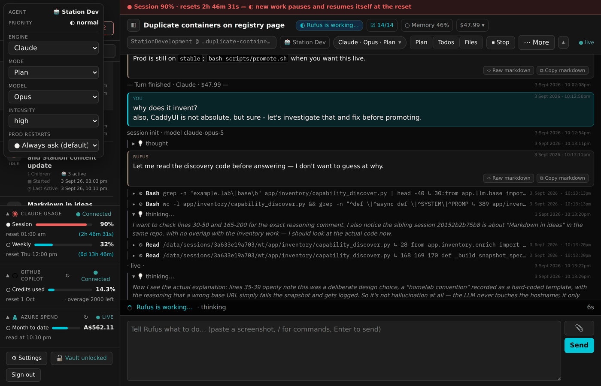
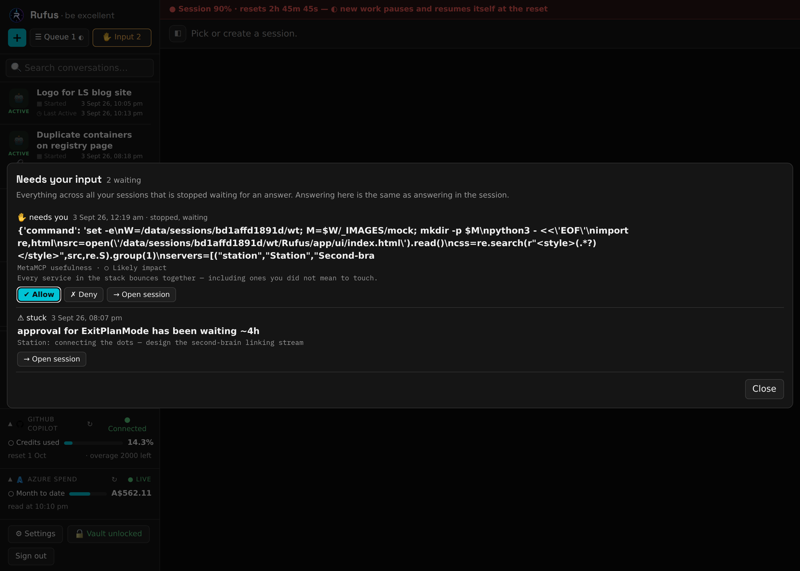
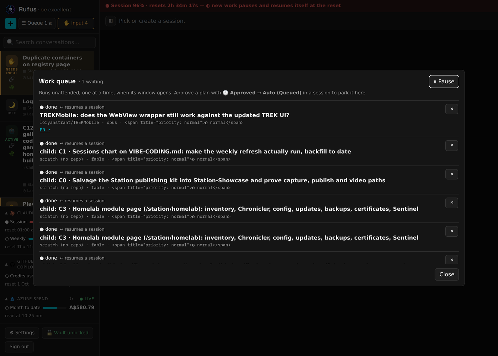
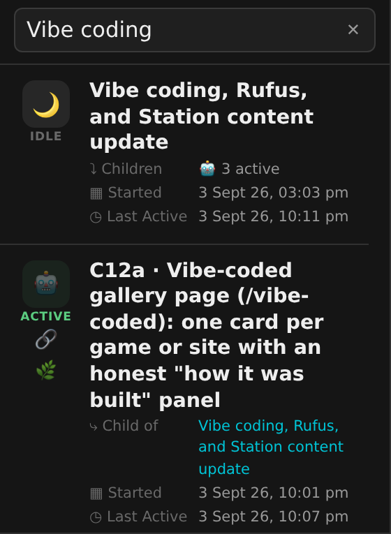
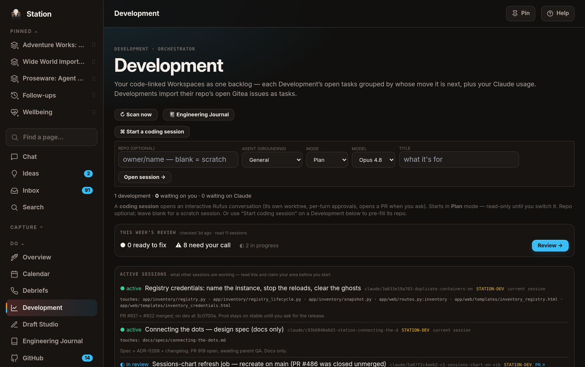
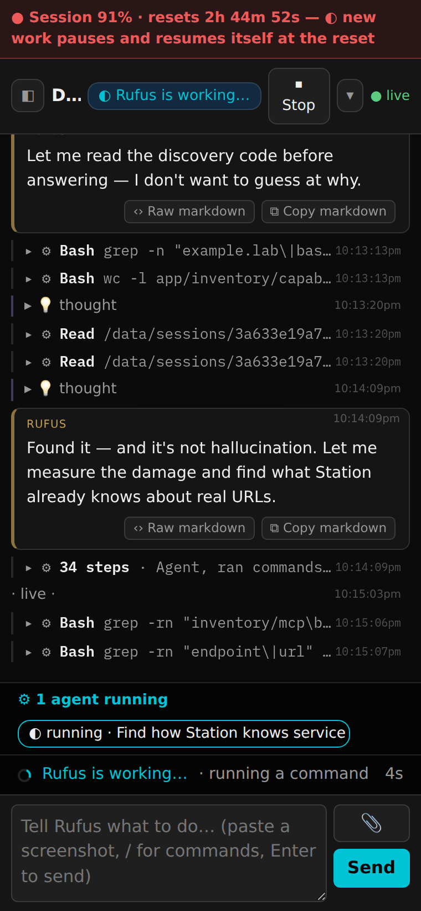
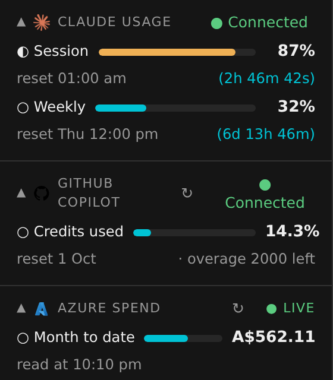

# Rufus: a sovereign AI coding cockpit

> *"Hi. Welcome to the future."* — Rufus, Bill & Ted's guide from the future. That's the job description: Station is the brain; **Rufus is the guide you actually talk to.**

*Everything on this page is as at **4 September 2026**, and every number carries the date it was true.*

About half of my AI-assisted development work is on the lab's own core systems — which creates an obvious chicken-and-egg problem: **the tool that fixes things has to keep working when things are broken.** Rufus is the answer. It's a self-contained coding container on separate hardware from everything it maintains, with its own storage, its own knowledge, and its own way in to every system it might need to repair. If the main platforms go down, Rufus is how they come back.

It was, naturally, vibe-coded — Rufus was built by the same agentic workflow it now hosts, and it has spent the last six weeks building itself. Between **24 July and 4 September 2026** it went from version **0.66.0 to 0.126.0**: **78 numbered releases**, **107 pull requests** merged, **258 commits**. I wrote none of the code and reviewed all of it.

## What it is

A session engine wrapped around a coding agent, with a deliberately thin web page and a native Android app in front of it. A **session** is one conversation about one piece of work. Each session gets its own private copy of the code and its own branch, so two sessions can work on the same project at the same time without treading on each other. Closing the laptop doesn't lose anything: re-open a session days later and both the conversation and the half-finished work are exactly where you left them.

Every session ends the same way — with a **pull request**, a proposed change that a human reads before anything is merged. Rufus is not allowed to merge. That isn't a setting; it's written into the code in a way no amount of persuasion gets past.

As at **4 September 2026** there are **472 sessions** on the box and **1.5 million lines** of recorded conversation behind them.

## Four engines, one piece of work

Sessions can change engine halfway through without losing anything, because the work lives in the session, not in the engine:

- **Claude Code** — the default, and the only one I'd point at production.
- **GitHub Copilot CLI** — a second, independent allowance, with the same ability to read and write files.
- **A self-hosted model** running on a graphics card in my own house — the advisor of last resort. It can think and suggest but not touch anything, and it needs nothing outside the building.
- **Azure OpenAI's GPT-5 family** — added as a chat advisor in July and promoted to a full coding peer on **5 August 2026**. On **12 August** it stopped being a special case: it now gets exactly the same house rules, the same approval cards and the same standing instructions as the others. It had been doing real work for a week under none of them, for the dull reason that nobody had ever told it any.

Adding a fifth would be a configuration entry, not a rewrite. The screen you start a session from is the same screen whichever engine you pick.

## What "failover" actually does now

The July version of this page said failover was automatic: run the main allowance down and Rufus hands the turn to the second engine. That was true then. It isn't now, and the reason is worth telling.

Since **1 August 2026**, a session that reaches the edge of its allowance **stops and waits instead of switching**. It parks the un-run instruction on disk, shows a paused badge with the reason and the reset time, and picks the work up by itself when the window reopens — same branch, same conversation, nothing lost. How close to the edge it gets before parking depends on how much I said the work mattered: **75% for low priority, 85% for normal, 95% for high**. Approving a plan parks about ten points earlier than an ordinary message, because saying yes to a plan is the single biggest jump in how fast an allowance burns.

Automatic engine-switching is still there and still works — it is simply **switched off by default**. Handing a turn from the first engine to the second quietly dropped a protection: the always-ask rule below is enforced on the Claude engine and cannot be enforced on Copilot, so a turn that *started* safe could *finish* unsafe. Pausing has no such hole. It's the same engine, later.

## The leash, and the day it wasn't tight enough

Agentic AI with keys to real infrastructure needs a leash. Reading runs freely. Anything consequential stops the session and appears as a **card** — in the browser and on my phone — until a human answers it. On top of that sits a short list of things that are refused outright in every mode, autonomous ones included: never merge on the public mirror, never touch the deployment machinery, never recreate the main app's container. The AI can't talk its way past those, and neither can I in a careless moment.

There is a fully autonomous mode. On **31 July 2026** it bit me. A session restarted **production home automation** while automations were mid-run, then restarted a second shared service that had never been in its plan. No card appeared for either — and the root cause was not a bug in the permission code. It was that the plan had been approved *by switching the session to autonomous*. **Approving a plan and handing over blanket permission were the same click.**

The same day, Rufus shipped a fix that is still my favourite thing in it. There is now a second list beside the never-list: things that **always ask, even in autonomous mode**. Restarts, stops, deployments, host reboots, routing changes. The restart still happens; it just cannot happen silently. On **13 August** the rule was sharpened so a target the system can positively identify as a *test* machine stands down with a note instead of a card, while anything ambiguous — an unknown name, a variable, a mixed list — still asks. Replayed against a real week, that removed about **60% of the interruptions** and none of the real restarts.

The card was also taught to say what it is about to break. It reads **what → impact → the exact command**, and the impact line is written from a catalogue keyed on the machine as well as the service, because half a dozen machines here run something called `caddy`.

Approvals are only half of it. The other half is Rufus asking me a question, and on **21 August 2026** questions stopped having a deadline. An approval can time out, because an approval has a safe answer: no. A question has no safe answer — the entire reason it was asked is that the model couldn't choose. Any deadline on a question is a coin flip wearing a policy's clothes. So a question now waits as long as it takes, appears once in an inbox and once on my phone, and never nags. Every card also ends with an optional *"anything else?"* box, so the sentence I want to add travels with my answer instead of losing a race with the next turn.

## Work that runs while I sleep

Approve a plan and, instead of running it now, you can park it in a **queue**. The queue runs one job at a time, unattended, starting when an allowance reopens or when another piece of work has actually landed. Each one produces a branch and a pull request to read in the morning.

Unattended does not mean unsupervised. A queued job that hits an approval doesn't guess and doesn't give up — it stops, writes the question down, and steps aside so the next job can run. Answer it whenever and that session picks up by itself. Say no and it *also* picks up, with my words, so it can tell me what it left undone.

## Sessions that create sessions

On **3 September 2026** a session gained the ability to start other sessions and take responsibility for them. This was never blocked — a session has always had the credentials to do it — but nothing had ever *told* it so, and three things it reads every turn implied the opposite, so it refused about half the time and had to be argued into it.

Now a session can start a **child**, watch it, answer its questions, and wrap it up. The parent sees its children's status at the top of every turn. The children know a parent is listening, so they ask instead of guessing. And there is one hard limit: **a parent cannot stand in for a human.** If a child hits one of the always-ask restarts, the parent is refused in code and told to escalate; when a parent *does* answer an ordinary question, the answer is recorded as coming from the parent, not from me, and the child is told so.

This page was built that way. A session I briefed in one sentence created **fifteen** children — roughly one per section of my website, plus the tooling and the videos — and reviewed each of them as it finished. Their rows in the session list say who their parent is.

## Station and Rufus, in both directions

[Station](https://www.loryanstrant.com/station/) is my self-hosted second brain, and the two systems now drive each other.

Station's **Development** board is a full front end for Rufus: it starts sessions with the repository, mode and model pre-filled, shows what every live session is touching so a new one can claim its ground, and lists everything waiting on me. Station also watches for new releases of the coding tool Rufus runs on and opens the change itself — one of Rufus's own version bumps in September was written entirely by Station noticing a release.

The other direction is deliberately kept thin, because Rufus exists precisely so it doesn't depend on Station. Rufus works out for itself whether it is safe to rebuild — it's the only thing that can see the session a rebuild would kill — and answers that question over its own health check. Merging a change builds the new version automatically; **deploying it stays a human decision**, because recreating the container kills every conversation in flight, including the one that just merged it. Since **30 August 2026** there are two buttons for that: deploy now, which says what it will stop, or deploy when nothing is running, which waits for the last turn to finish even if that's at three in the morning.

## On my phone

There's a native Android app. It shows the same sessions, the same feed, and the same approval and question cards — tap Allow on the couch and the session in the study carries on.

Notifications are a small piece of engineering I'm quietly pleased with: the app **polls over my own network** and there is no push service, no Google cloud in the path, nothing leaving the house. Rufus is reachable on the home network and over a private tunnel, and nowhere else.

Web and phone stay in step because they speak one shared vocabulary of events, and the test suite refuses a build that invents a new one. That's why most releases need no new app build at all — and why the releases that *do* say so out loud in the release notes.

The browser page learned to be a phone in **late August 2026**: below a certain width the session list becomes a drawer, the top bar folds to a single line, and the buttons that used to appear only on hover — which is to say, never, on a touchscreen — became real.

## What it costs, and what it can reach

The sidebar carries meters, because an AI coding habit is a budget with a reset clock attached. As at **10:10 pm AEST on 3 September 2026** it read: main allowance **87%** used with **2h 46m** to the reset, weekly allowance **32%** with six days to go, Copilot credits **14.3%**, and Azure spend **A$562.11** for the month against its monthly credit. Every session header also shows what that conversation has cost so far.

Status is always a **shape and a word** — ● ◐ ○, never colour alone. I'm colour-blind; a red dot beside a green dot is just two dots to me.

Rufus reaches the rest of the lab through a **registry of tools** — one entry per system, each declaring what it is, where it lives and whether it may write. Since **3 September 2026** a session is wired straight to the tools it needs from that registry, with two always on and the rest added on demand mid-session. The gain is small and enormous: a system that is *down* is now **named** as down. Before, its tools simply vanished from the list, and a session would conclude the capability didn't exist and go and reinvent it by hand — a mistake that cost real money more than once before anyone noticed the pattern.

Writes to infrastructure raise a card even in autonomous mode. Reads don't.

## Everything it does is written down

Every session's transcript is scrubbed and pushed to a single archive. Scrubbing works **by shape, not by list**: anything shaped like a credential is masked whether or not anything knew it existed, because the version that only knew its own seven secrets was publishing everyone else's. The same patterns act as a gate on the way out — a change containing something secret-shaped cannot be pushed at all. The first thing that gate ever caught was its own test file.

Station reads that archive and narrates it. As at **4 September 2026** its engineering journal holds **647 archived coding sessions** going back to **21 May 2026**, **474** of them since this rewrite's predecessor was published on 24 July.

And the work is reviewed by something that didn't write it. Since **2 August 2026**, pushing a branch kicks off independent read-only reviews — code, user interface with real screenshots, and whether the change matches the specification it claimed to implement — merged into one comment on the pull request. Never a rejection: the human stays the only gate. In-session, a separate reviewer that cannot edit checks anything non-trivial, because the writer is never the judge.

## What this isn't

It isn't a product and it isn't for sale. It runs on hardware in my house, for one person, and a good part of it exists because I wanted to find out whether it could. It isn't hands-off either — the interesting parts are all about where a human has to press something.

Rufus's own source stays private by design: it embeds access to the whole lab.

This page and the [vibe coding overview](VIBE-CODING.md) are the public window, and the same write-up with more screenshots lives at [loryanstrant.com/station/rufus](https://www.loryanstrant.com/station/rufus/).

The screenshots are the real thing, taken on **3 September 2026**. Machine names are real. Addresses, credentials, client names and anything about my family are not on this page and never will be.
