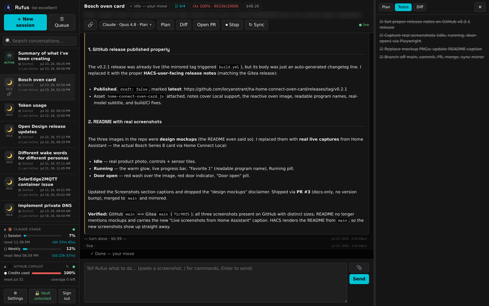
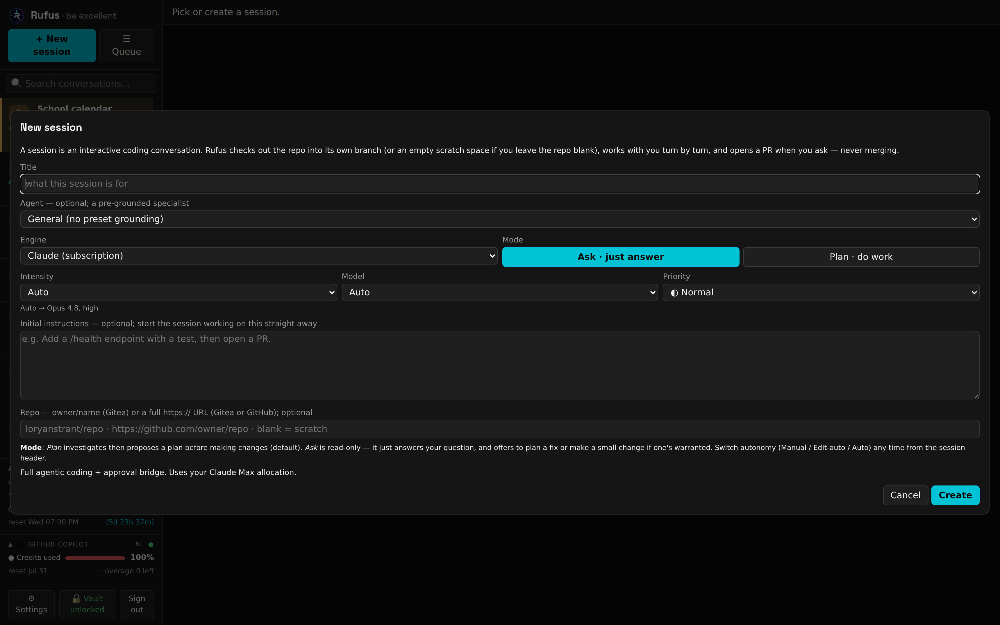
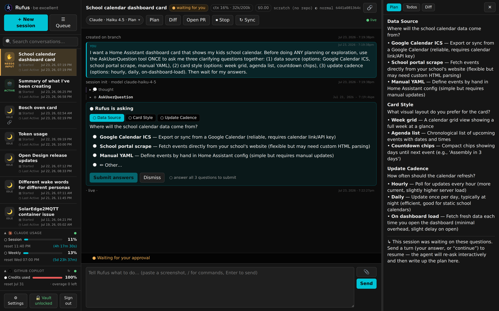
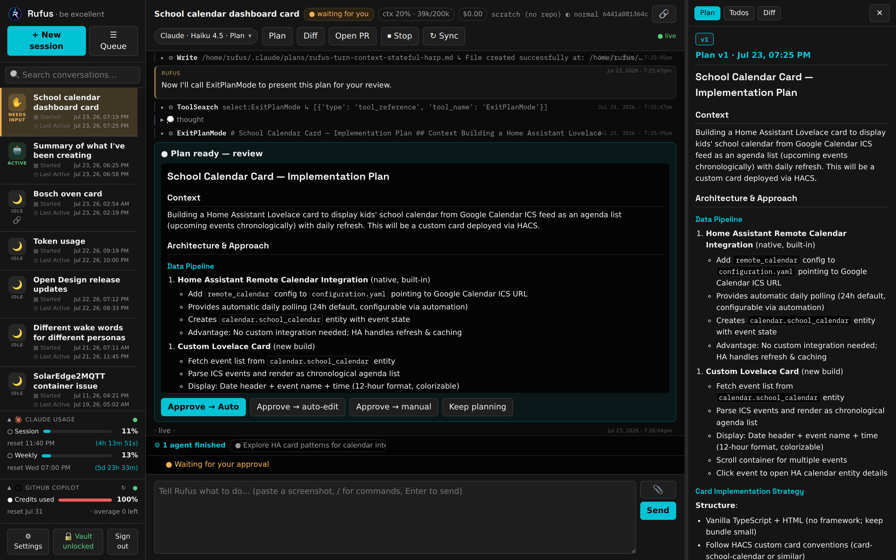

# Rufus: a sovereign AI coding cockpit

> *"Hi. Welcome to the future."* — Rufus, Bill & Ted's guide from the future. That's the job description: Station is the brain; **Rufus is the guide you actually talk to.**

About half of my AI-assisted development work is on the lab's own core systems — which creates an obvious chicken-and-egg problem: **the tool that fixes things has to keep working when things are broken.** Rufus is the answer: a self-contained coding container on separate hardware from everything it maintains, with its own storage, its own knowledge, and its own way in to every system it might need to repair. If the main platforms go down, Rufus is how they come back.

It was, naturally, vibe-coded — Rufus was built by the same agentic workflow it now hosts.

## What it is

A session engine (FastAPI) wrapped around **Claude Code via the Agent SDK**, with a deliberately thin web UI and a native Android app. Each coding session gets its **own git worktree and branch**; resuming a session restores both the conversation *and* the working tree, so follow-up turns keep refining the same change. Every session ends the same way: a **pull request** — reviewed by a human before anything merges.

## Three engines, one worktree

Sessions can switch engines mid-feature without losing state:

- **Claude Code** (default) — fully agentic, with the approval bridge below.
- **GitHub Copilot CLI** — the second engine, used when Claude allocation runs low.
- **Local LLM** — a self-hosted model as the advisor of last resort: chat-only, proposes changes without editing, zero cloud dependency.

Failover is automatic and usage-aware: Rufus tracks live subscription usage, and when the Claude window is nearly exhausted it hands the turn to Copilot until the window resets — then falls back further to the local model if Copilot is spent too. A **session queue** takes briefs (repo + prompt) and runs them one at a time unattended, each producing a PR to review in the morning.

## The approval bridge

Agentic AI with infrastructure access needs a leash. Read-only actions run freely; consequential actions **block the session and surface as approval cards** in the UI (and on the phone) until a human answers. On top of that, a set of house rules — never merge a PR on the public mirror, never touch the deploy clone, no destructive container recreates — is **hard-blocked in code, in every permission mode**, including fully autonomous ones. The AI can't talk its way past them, and neither can I in a careless moment.

The same bridge carries structured questions: when the agent needs a decision, it stops and asks — a multi-question card with options, blocking the turn until answered.

Plan-first is the default working style: the agent investigates, writes up an implementation plan, and presents it for review — with a choice of how much autonomy to grant for the execution. Nothing touches a file until the plan is approved.

## Senses

Rufus can reach what it needs to fix: the container runtime on its own host, every fleet machine over SSH, the main platform's database directly (which is how it troubleshoots that platform while the app is down), the deployment API, and read-only HTTP across the internal service mesh. Secrets stay in a vault that's unlocked per-session from the UI, held in memory only.

## Part of a bigger loop

Rufus feeds the same telemetry and archive pipeline as everything else: live usage stats flow to Station's dashboard, and every session transcript lands in the archive that Station's engineering notebook narrates. When Station is up, it acts as a rich front-end — starting and steering Rufus sessions from its own development board, approval cards included. When Station is down, Rufus's built-in UI is the break-glass path.

---

*Rufus's source stays private by design — it embeds access to the whole lab. This page and the [vibe coding overview](VIBE-CODING.md) are the public window.*
