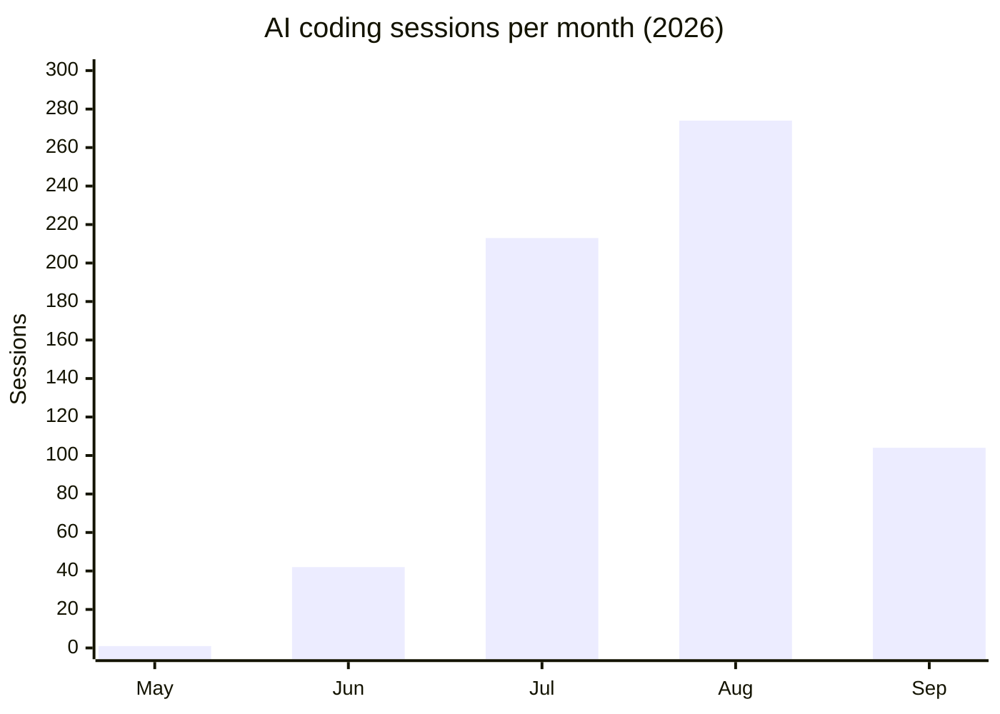

# Vibe coding: what I've built with agentic AI

By day I'm a Microsoft 365 consultant and MVP. Outside of that, I design, build, and operate a portfolio of production software **and the infrastructure it runs on** almost entirely through **agentic AI** — primarily Claude Code, with Azure's GPT-5 and GitHub Copilot CLI as full peer engines beside it — applied with real engineering discipline: everything ships through pull requests, tests, architecture decision records, and docs written in the same commit as the code.

This page is the short version of what that looks like in practice. Every number on it carries the date it was true.

## The cadence

Every AI coding session is automatically archived to a private git repository and narrated into an engineering notebook (more on that below), which makes the pace easy to measure. As at **4 September 2026**: **653 sessions since 21 May 2026**, and **20,384 exchanges** inside them — about 31 per session, though the shape of a session has changed more than the count has. Early ones were me and a chat window. Recent ones are a session that goes away and runs a dozen more.

Month by month: 1 in May, 42 in June, 213 in July, 274 in August, and 123 in the first four days of September — which is not a typo, it's what happens when one session is allowed to start others.

<!-- sessions-chart:start -->

<!-- sessions-chart:end -->

*(The last bar is the current, partial month. The chart is redrawn weekly, month by month, straight from the engineering notebook's own data — so the September bar lags the paragraph above it by a few days, and I'd rather show you that than quietly hand-edit the picture.)*

Which engine actually did the work, across all 653: **572** Claude, **63** Azure's GPT-5 family, **14** GitHub Copilot, **3** Station's own chat, and **1** a model running on my own GPU. That split is a cost-and-availability decision, not a loyalty one.

## The flagship: Station

**[Station](https://www.loryanstrant.com/station/)** is a self-hosted "second brain" — the largest thing I've vibe-coded and the centre of everything else. FastAPI and PostgreSQL under the hood, with semantic memory and a knowledge graph, an MCP server that exposes it to other AI agents, a native Android app, and a voice "Daily Debrief" that phones me at the end of each workday in a clone of my own voice. In July it was a thinking and planning tool. Since then it has taken over my health reminders, my homelab, my work day and — the part that still makes me laugh — **its own software development**. It's not a product: no download, no waitlist, one person's tool, shown honestly.

It's grown too big for one page, so it's now a hub with a page per room. These are publishing through September 2026, so a few of these links go live as I finish them:

- **[The grand tour](https://www.loryanstrant.com/station/tour/)** — every screen, grouped the way the app's own sidebar is.
- **[Capturing things](https://www.loryanstrant.com/station/capturing-things/)** — one box, three levels of pushback, and seven other doors in.
- **[From idea to done](https://www.loryanstrant.com/station/from-idea-to-done/)** — plans, tasks and calendar: one row in the database, four views.
- **[The daily rhythm](https://www.loryanstrant.com/station/daily-rhythm/)** — inbox, meetings, the evening phone call, follow-ups.
- **[AI overviews](https://www.loryanstrant.com/station/ai-overviews/)** — what Gemini and NotebookLM made of it. One is very funny.
- **[Wellbeing](https://www.loryanstrant.com/station/wellbeing/)** — medication reminders, meals in plain words, and my rhythms mined from the house's own sensors.
- **[The homelab](https://www.loryanstrant.com/station/homelab/)** — the fleet map, the "why" layer, container updates, backups, certificates.
- **[Work](https://www.loryanstrant.com/station/work/)** — a workspace per engagement, and a "state of play" that cites its evidence.
- **[Helpers and agents](https://www.loryanstrant.com/station/helpers/)** — what each one may touch, and what it reports back.
- **[Station builds itself](https://www.loryanstrant.com/station/builds-itself/)** — the development board, the gate, and Station deploying the tool that writes its code.
- **[Voice, chat and files](https://www.loryanstrant.com/station/voice-chat-files/)** — it speaks in my actual voice.
- **[What changed](https://www.loryanstrant.com/station/whats-new/)** — the Ember redesign, and why the front page became a worklist.
- **[Family, school and home](https://www.loryanstrant.com/station/home-and-family/)** — words only. No screenshots, on purpose.
- **[Rufus](https://www.loryanstrant.com/station/rufus/)** — the coding cockpit that built nearly all of it.
- **[Origins and growth](https://www.loryanstrant.com/station/origins/)** — from a capture box in April to this, with the numbers charted.

One thing worth calling out from that list, because it's the most-asked question: Station also **writes in my voice**. It grounds a brief in things I've actually published, drafts into a private repo where every revision is a commit, and then diffs the draft against what I really posted — because the edits I make by hand are the strongest possible signal of how I actually write. [Here's a first post, with the prompt I gave it and the piece it produced, side by side](station-first-post.md).

## The AI builds its own workshop

The part that tends to interest people most: the AI tooling is itself vibe-coded.

- **[Rufus](RUFUS.md)** — a sovereign coding container that runs the coding agents with its own web cockpit and mobile app, deliberately independent of everything it maintains, so AI-assisted engineering keeps working even when the rest of the lab is down. *[Full write-up with screenshots →](RUFUS.md)*
- **Sessions that start other sessions.** A session can now spawn its own children, hand each one a written brief, answer their questions and review their work. This set of pages was built exactly that way: one parent session running **fifteen** children as at 4 September 2026 — roughly one per page, plus the two that built the tooling the rest of them needed — while I answered the handful of questions only I could answer. It is the single biggest change to how I work since I started.
- **A queue that runs overnight.** Briefs go in — a repository and a paragraph — and get worked one at a time, unattended, each producing a change to review in the morning.
- **Four engines, one working copy.** Claude drives by default. Azure's GPT-5 is a full peer I pick deliberately when I want to spare the Claude allowance — that's the 63 sessions above, not a fallback. When the Claude allowance runs low, a session no longer hands the turn to another engine: since 1 August 2026 it **parks and resumes itself** when the window reopens, same branch, same conversation, because a hand-off to Copilot would quietly drop the always-ask rule that only the Claude engine enforces. Automatic switching still exists and is off by default; the model on my own GPU remains the advisor of last resort. Whichever is driving, the work in progress doesn't move.
- **A standards repo the agents consume.** Coding conventions, the map of the house, and security rules live in a `dev-standards` repository that every agent session loads on boot — the agents follow the house rules because the house rules are code.
- **An engineering notebook that writes itself.** Every session is archived raw, then a small model on my own hardware turns the archive into a plain-English diary — per day, per project. **319 diary days across 48 projects** as at 4 September 2026. It answers "what was I doing on the 18th of August, and why" without re-reading a five-hour conversation.
- **MCP everywhere, and no middleman.** The lab's services sit behind **31 registered MCP servers** (as at 4 September 2026), and this is where I've changed my mind since July: they used to sit behind a single gateway, and each session now connects **directly** to the handful of servers its job actually needs. The gateway was one more thing that could go quiet — and when a service vanished from its list, there was no way to tell "it's broken" from "it was deliberately removed".
- **The chart above is itself a lesson.** It claimed to refresh weekly and hadn't moved since 20 July. There was no broken job to find: **the job never existed**. An attempt at it had been written and abandoned, and its absence looked exactly like a job that had simply never fired. It runs now — and the screen listing every scheduled task now distinguishes **● ran** from **○ skipped, with the reason** from **⚠ failed**, because those three had been rendering as one.

## Agents and ambient AI

- **Sentinel** — a watchman sweeping every 15 minutes across disks, containers, certificates, network gear and the automations in the house. As at 3 September 2026: **853 sweeps, 78 conditions opened, 65 resolved**. It's allowed to perform exactly **two** repairs, written in code rather than chosen by a model, and both ship switched off. Its best rule is about silence: **a missing answer is never a healthy one** — if a source goes quiet, the silence itself becomes the problem.
- **Hermes** — an overnight analyst with read-only access to Station that reviews the day's data and leaves its thinking behind for the morning.
- **Meeting task capture** — a desk microphone that turns commitments I make in meetings into tasks. **Consent matters here, so this is built to record exactly one person: me.** The speaker-identification model is trained on my voice alone; audio that doesn't match my voiceprint is discarded on the spot, never transcribed and never stored. Other participants are not recorded — full stop.
- **A fully local voice and LLM stack** — text-to-speech, Whisper transcription, and locally-hosted models on my own GPUs. The ambient parts of the system don't send audio or personal data off the network.

## Beyond code: AI-assisted operations

Not everything the agents do is development. The same tooling runs the operations side of the lab, and increasingly that's where it earns its keep. The July list still stands:

- standing up an **observability platform** — metrics, logs, and dashboards across every host
- rolling out **internal DNS** and reverse-proxy routing
- **network troubleshooting** and presence-sensor tuning
- **container cleanups**, memory-leak hunting, and performance diagnosis
- and the occasional oddball, like designing the control panel for the sauna

What's been added since, all of it built because something went wrong in a way I could feel:

- **Sentinel got a written fix list** (21 August 2026) — two permitted repairs, and nothing outside them can run. Off isn't idle: it still works out what it *would* have done and offers it as a button.
- **Backup Guardian** — watches **8 backup jobs across 6 sources**, keeps its own permanent history rather than trusting the last email, and sends one digest at 8:15 am instead of nine boring ones a day. Its most important tile reads **0 not checked**, because "not checked" is a first-class answer and is never rounded down to fine.
- **Certificates that renew themselves.** On 1 September 2026 I found a certificate for my own domains *hours* from expiring. The tool everyone assumed was handling it had done nothing since 13 July, and the save button had been reporting success while deploying precisely nothing. It's now fetched daily and pushed everywhere it's needed.
- **A container updates board.** The industry answer is a daily email listing new versions — on 3 September 2026 mine read "checked 145 containers, 26 with a newer image", which is a fact, not a decision. So updates are now judged against *how I actually use the thing*, sorted into lanes where only **● Needs you** is allowed to interrupt me, and grouped by **what restarts together** rather than by container.
- **Station deploys Rufus.** When a new model shipped on 1 September 2026, neither coding tool could reach it and neither said so. Station now watches for releases of the tool that writes its code, proposes the one-line change in each affected project, folds it in when the tests pass, deploys, and confirms from inside the running software that the new version is really there. It can't restart a live coding session — it *asks* the tool to redeploy when nothing is running.
- **The pull-request gate moved into the server** (27 August 2026). A change that breaks the tests, or touches code without a written note of what changed, cannot be merged **by any tool, whatever its summary claims**. I proved it by deliberately proposing a broken change. It was refused.

In practice it's an operations partner with perfect recall of the whole environment, not just a code generator.

## Games and sites

Not everything is infrastructure. Some of it is a Sierra-style adventure game about my own cluttered brain. Each of these has an honest **"how it was built"** card in the gallery — elapsed time, sessions, models, and the cost where a meter exists, with the figures the archive can't support left blank rather than guessed at.

**[See the whole gallery, with a build card each →](https://www.loryanstrant.com/station/vibe-coded/)**

- **[Loryan Quest V: The Next Distraction](https://loryanquestv.strant.com)** — a point-and-click trip through my brain. Four rooms, one verb that matters, and a door you never open. It has [its own measured build report](https://loryanquestv.strant.com/about.html): 29 commits and about 7,095 lines, for **US$270.03** of metered model usage.
- **[The Maze: an 8-bit Westworld tribute](https://loryanstrant.github.io/westworld-the-game/)** — collect reveries, dodge hosts stuck in their loops, wake up before your stability runs out. ([source](https://github.com/loryanstrant/westworld-the-game))
- **Quidditch: Twilight Pitch** — fly the Chasers; when the Snitch appears the game hands you the Seeker and wishes you luck. Not hosted anywhere — screenshots only.
- **[Humbled & Honored](https://www.humbledandhonored.com)** — my light-hearted home for Microsoft MVP renewal season, with statistics, a playlist and industrial-strength humblebragging.
- **[Let Me Correct That For You](https://www.letmecorrectthatforyou.com)** — a polite public service for the moments when a product name is almost right, which is often when it's most wrong. ([source](https://github.com/loryanstrant/LetMeCorrectThatForYou))
- **[Microsoft Cloud Logos](https://www.mscloudlogos.com)** — the logo drawer I wanted: searchable, downloadable, much less mysterious than image search. ([source](https://github.com/loryanstrant/MicrosoftCloudLogos))
- **[The Rebrand Registry](https://wonderful-ocean-034ff8f1e.7.azurestaticapps.net)** — Microsoft cloud product names on a timeline, because apparently one name per product was too easy. Still on its default Azure hostname. ([source](https://github.com/loryanstrant/Microsoft-Rebrand-Registry))
- **[Copilot Credit Estimator](https://red-beach-0964a781e.6.azurestaticapps.net)** — pick your ambition, sprinkle in governance, receive a very serious-looking estimate for an entirely fictional programme. Also on a default Azure hostname.
- **The M365 Copilot reporters** — [Prompt Analyser](https://github.com/loryanstrant/M365Copilot-Prompt-Analyser), [Usage Reporter](https://github.com/loryanstrant/M365Copilot-Usage-Reporter) and [Cowork Reporter](https://github.com/loryanstrant/M365Copilot-Cowork-Reporter): deployable reporting stacks for how Copilot is actually being used, without making Power BI a prerequisite.
- **[Copilot Studio Agent Quality Reporter](https://github.com/loryanstrant/CopilotStudio-Agent-Quality-Reporter)** — a health check for Copilot Studio agents: what's working, what's wobbling, what to improve next.

And the rest of the public shelf: **[my Home Assistant integrations, themes and dashboard cards](home-assistant.md)** — auto-updated weekly, and rather a lot of them — plus [ESPHome-MCP](https://github.com/loryanstrant/ESPHome-MCP), [azure-openai-sora-2-webserver](https://github.com/loryanstrant/azure-openai-sora-2-webserver), [plumbus](https://github.com/loryanstrant/plumbus) (ssh/rsync backups with a web UI) and [simple-wik](https://github.com/loryanstrant/simple-wik) (a self-hosted Markdown wiki).

## How it actually works

Vibe coding at this scale only holds together with discipline. The method:

1. **Plan first.** Non-trivial work starts with a written plan that I review before any code is touched.
2. **Everything is a pull request** on a self-hosted git forge, reviewed before merge — the AI never commits to main. And since August 2026 that isn't a house rule, it's the server refusing.
3. **Standards as code.** Conventions live in a repo the agents load every session, not in my head.
4. **Verify the real artefact.** A green build proves nothing; sessions end by hitting the live endpoint, checking the data, reading the log. A "success" message tells you the thing was asked for, not that it happened.
5. **Follow up on what shipped.** Every feature is registered with a test plan and brought back at 2, 7, 14 and 30 days — *did you actually use this?* As at 3 September 2026 that's **161 features registered** and **87 check-ins answered**. Nothing gets built and then quietly forgotten.
6. **Assume silence is a symptom.** Nearly every expensive mistake on this page looked identical to nothing being wrong. Most of what I've built since exists to tell those two apart.

## What it costs

Honest answer: **I can only price part of it, and I'd rather show you the gap than a confident total.**

Metered per-session costs exist only for sessions run through Rufus, and only since it started recording them in August 2026. As at **4 September 2026**, **96 of the 653 archived sessions** carry a metered figure, totalling **US$5,367.24** — US$5,225.02 across 95 sessions in August, US$142.23 in September so far.

Three things that number is not:

- **It is not my total spend.** It's the cost of the sessions that carried a meter — under one in six. The other 557 sessions cost something; the archive just doesn't know what.
- **It is not what I paid.** It's metered model usage. Most of the work runs inside subscriptions, and a good deal of it runs on models on my own hardware, which cost electricity.
- **It is not a rate card.** One game — Loryan Quest V — accounts for US$270.03 of it, and one week of building these very pages accounts for a great deal more.

Where a build card in the gallery can't support a figure, it says so rather than estimating. Missing telemetry is shown as missing, not as zero.

## What's next

- **These pages.** The modules linked above are publishing through September 2026, and each gets a short narrated video in a clone of my own voice.
- **Station renewing its own sign-ins.** One of its cloud logins expired in July and stayed dead for 29 days while everything quietly fell back to the local model. Station now *detects* that within 15 minutes. Fixing it unattended is the next rung, deliberately held back until the detection has proven itself.
- **A "build this" agent.** When an idea looks buildable, gather the configs, repos and notes Station already holds and open a conversation proposing how to build it.
- **Feedback that changes what gets retrieved.** Station has been collecting thumbs-up and thumbs-down on its answers for months and nothing reads them yet.

What I'm *not* reaching for: unattended dispatch — the agents starting work while I sleep — was built and deliberately shipped switched off. Overturning the attended-only rule is a decision for a human, not a feature flag. I am still the only one who can say yes.

If you'd like to talk about any of this — the tooling, the method, or the lessons learned — I'm easy to find.
