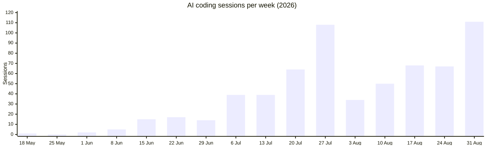

# Vibe coding: what I've built with agentic AI

By day I'm a Microsoft 365 consultant and MVP. Outside of that, I design, build, and operate a portfolio of production software **and the infrastructure it runs on** almost entirely through **agentic AI** — primarily Claude Code, with GitHub Copilot CLI as a second engine — applied with real engineering discipline: everything ships through pull requests, tests, architecture decision records, and docs written in the same commit as the code.

This page is the short version of what that looks like in practice.

## The cadence

Every AI coding session is automatically archived to a private git repository and narrated into an engineering notebook (more on that below), which makes the pace easy to measure: **220+ sessions in the first nine weeks**, averaging around 70 exchanges per session, and ramping from a handful of experiments to a sustained 50–70 sessions per week.

<!-- sessions-chart:start -->

<!-- sessions-chart:end -->

*(The last bar is a partial week; the chart refreshes weekly, straight from the engineering notebook's data.)*

## The flagship: Station

**[Station](https://www.loryanstrant.com/station)** is a self-hosted "second brain" — the largest thing I've vibe-coded and the centre of everything else. FastAPI and PostgreSQL under the hood, with semantic memory and a knowledge graph, an MCP server that exposes it to AI agents, a native Android app (Jetpack Compose), and a voice "Daily Debrief" that phones me at the end of each workday to capture a journal and turn commitments into tasks. It even runs a telemetry-driven follow-up loop that checks in on every shipped feature at 2, 7, 14, and 30 days — so nothing gets built and then quietly forgotten.

Hundreds of pull requests, every one reviewed, with migrations, test suites, and a documented deploy-and-rollback path. Built almost entirely by AI agents; directed, reviewed, and occasionally rescued by me.

## The AI builds its own workshop

The part that tends to interest people most: the AI tooling is itself vibe-coded.

- **[Rufus](RUFUS.md)** — a sovereign coding container that runs the AI coding agents (Claude Code, Copilot CLI, and a local LLM fallback) with its own web cockpit and mobile app, deliberately independent of the rest of the lab so AI-assisted engineering keeps working even when everything else is down. *[Full write-up with screenshots →](RUFUS.md)*
- **A standards repo the agents consume.** Coding conventions, infrastructure maps, and security rules live in a `dev-standards` repository that every agent session loads on boot — the agents follow the house rules because the house rules are code.
- **An engineering notebook that writes itself.** Every coding session is archived raw to git, then Station's journal component turns the archive into readable narrative entries — a searchable history of what was built, how, and why.
- **MCP-first operations.** The lab's services sit behind an MCP gateway — around 26 services and 1,100+ tools — so agents observe and operate everything through MCP rather than bespoke API calls or poking at servers.
- **Containers everywhere.** Everything is built into Docker containers — portable, sandboxed, reproducible — with internal DNS and a reverse proxy giving every service a clean, stable name.

## Agents and ambient AI

- **Hermes** — an overnight analyst agent with read-only access to Station that reviews the day's data and leaves its thinking behind for the morning.
- **Meeting task capture** — a desk microphone that turns commitments I make in Teams meetings into Station tasks, validated end-to-end on real calls. **Consent matters here, so this is built to record exactly one person: me.** The speaker-identification model is trained on my voice alone; audio that doesn't match my voiceprint is discarded on the spot, never transcribed and never stored. Other participants are not recorded — full stop.
- **A fully local voice and LLM stack** — text-to-speech, Whisper transcription, and LocalAI-hosted models running on my own GPUs. Privacy by design: the ambient parts of the system don't send audio or personal data off the network.

## Beyond code: AI-assisted operations

Not everything the agents do is development. The same tooling runs the operations side of the lab, and increasingly that's where it earns its keep:

- standing up an **observability platform** — metrics, logs, and dashboards across every host
- rolling out **internal DNS** and reverse-proxy routing
- **network troubleshooting** and presence-sensor tuning
- **container cleanups**, memory-leak hunting, and performance diagnosis
- and the occasional oddball, like designing the control panel for the sauna

In practice it's an operations partner with perfect recall of the whole environment, not just a code generator.

## A selection of public repos (all vibe-coded)

- [ESPHome-MCP](https://github.com/loryanstrant/ESPHome-MCP) — an MCP server for ESPHome devices
- [azure-openai-sora-2-webserver](https://github.com/loryanstrant/azure-openai-sora-2-webserver) — containerised video generation against Sora 2 in Azure OpenAI
- [HA-Azure-AI-tasks](https://github.com/loryanstrant/HA-Azure-AI-tasks) — Home Assistant AI tasks powered by Azure AI
- [HA-LocalAI-Monitor](https://github.com/loryanstrant/HA-LocalAI-Monitor) and [HA-ElevenLabs-Custom-TTS](https://github.com/loryanstrant/HA-ElevenLabs-Custom-TTS) — Home Assistant integrations for local and cloud AI services
- [HA-Personal-Hydration-Manager](https://github.com/loryanstrant/HA-Personal-Hydration-Manager) — household water-intake tracking with its own Lovelace card
- [ha-MU-TH-UR-6000-cards](https://github.com/loryanstrant/ha-MU-TH-UR-6000-cards) and [HA-Transformers-Allspark-UI](https://github.com/loryanstrant/HA-Transformers-Allspark-UI) — themed dashboard suites (Alien and Transformers, naturally)
- [HA-Cortana-satellite-rings](https://github.com/loryanstrant/HA-Cortana-satellite-rings) — the Cortana ring animation for Home Assistant voice satellites
- [plumbus](https://github.com/loryanstrant/plumbus) — a simple ssh/rsync backup system with a web UI
- [simple-wik](https://github.com/loryanstrant/simple-wik) — a self-hosted Markdown wiki, RAG-ready for AI integration

## How it actually works

Vibe coding at this scale only holds together with discipline. The method:

1. **Plan first.** Non-trivial work starts with a written plan that I review before any code is touched.
2. **Everything is a pull request** on a self-hosted git forge, reviewed before merge — the AI never commits to main.
3. **Standards as code.** Conventions live in a repo the agents load every session, not in my head.
4. **Verify the real artefact.** A green build proves nothing; sessions end by hitting the live endpoint, checking the data, reading the log.
5. **Follow up on what shipped.** Feature telemetry and scheduled check-ins catch the things that worked in the demo and failed in real life.

If you'd like to talk about any of this — the tooling, the method, or the lessons learned — I'm easy to find.
